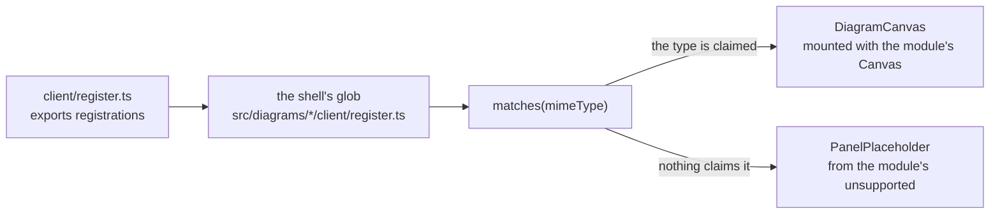
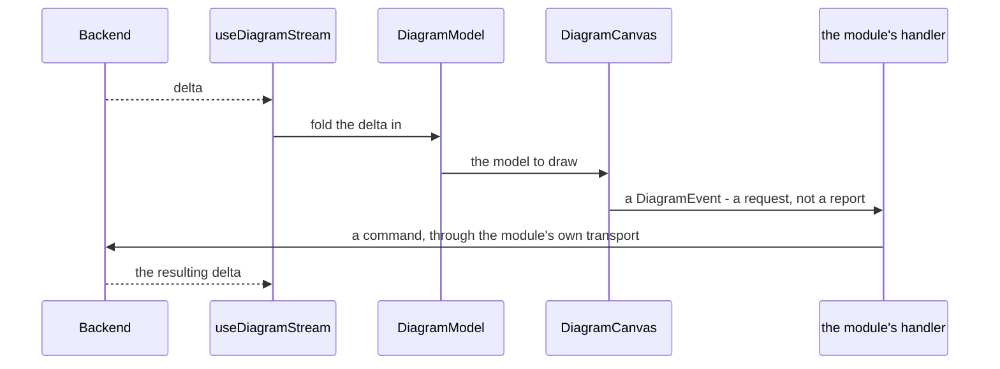
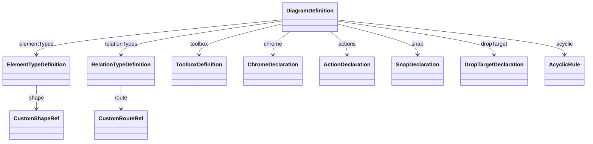
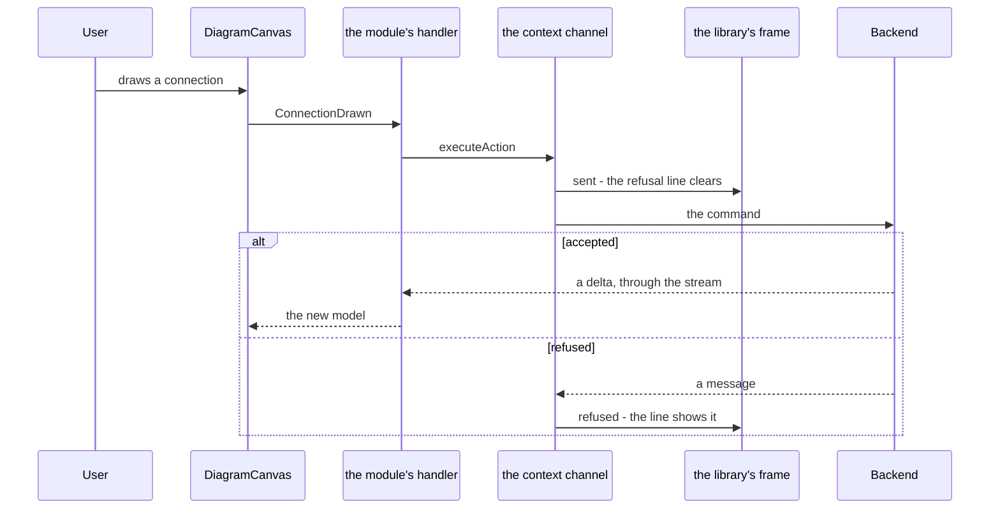
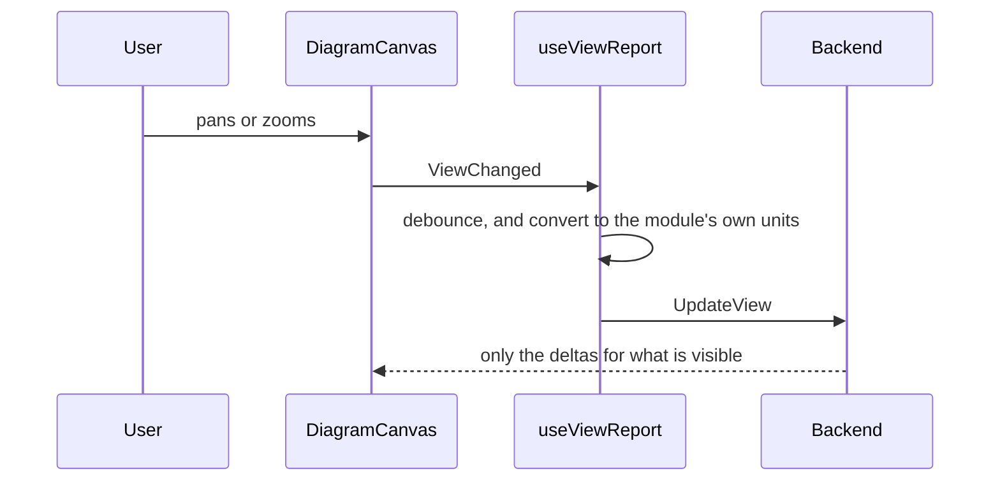

# The diagram module client API

**Everything a diagram module's client may reach for, and nothing it may not.** One document, so a module author does not have to read the canvas library to find out what is offered — and so a name leaving module use is a change to a page rather than a discovery made by a broken build.

## How to read this document

**Each entry answers the same six questions, in the same order:** what the thing is for; whether a module needs it and what happens without it; its shape; a worked example taken from a real module; the guards that constrain it; and what to read next.

**An entry begins with its declarations.** The line `**Declarations:**` names, in backticks, every declaration the entry covers. Those lines together are what this document claims to cover, and the test reads them:

```
### Element types
**Declarations:** `ElementTypeDefinition`, `BuiltInShape`, `CustomShapeRef`
```

**An excerpt names its source.** A fenced code block is preceded by a `Source:` line linking the file it was taken from, and the block appears in that file verbatim, line endings aside:

```
Source: [`src/diagrams/dependency-graph/client/DependencyGraphCanvas.tsx`](../src/diagrams/dependency-graph/client/DependencyGraphCanvas.tsx)
```

**`dependency-graph` is the reference module.** Examples come from it wherever it exercises the aspect, so a reader following one module's code can find every excerpt in one place rather than assembling a picture from eight.

### What is authoritative here, and what is linked

**This document is authoritative for the module-facing surface**: which declarations a module may use, what each is for, and which are library-internal. When it disagrees with a module that reaches past the surface, this document is right and the module is the thing to change.

**It is not authoritative for mechanism.** How the canvas draws, how scrolling works, how a label is measured and how the stream is consumed are described where that code lives, and this document links them rather than restating them:

- [`src/client/src/diagrams/readme.md`](../src/client/src/diagrams/readme.md) — the stream, the view report and the module-side hooks
- [`src/client/src/canvas/elements/readme.md`](../src/client/src/canvas/elements/readme.md) — element geometry and shapes
- [`src/client/src/canvas/library/shapes/readme.md`](../src/client/src/canvas/library/shapes/readme.md) — the built-in shapes' outlines: which shapes have one, the text region and edge point each derives from it, and how to add a shape
- [`src/client/src/canvas/label/readme.md`](../src/client/src/canvas/label/readme.md) — label measurement and placement
- [`src/client/src/canvas/gesture/readme.md`](../src/client/src/canvas/gesture/readme.md) — the shared gesture layer
- [`src/client/src/canvas/scroll/readme.md`](../src/client/src/canvas/scroll/readme.md) — scrolling and the viewport

**And it is not a tutorial.** [`creating-a-diagram-module.md`](creating-a-diagram-module.md) walks a whole module from nothing to a drawn diagram; this document is what that walkthrough reaches into, entry by entry.

### How this document stays true

**It is checked against the code on every client test run, not reviewed.** The command is:

```bash
npm test -- src/diagramModuleClientApi.test.ts
```

from `src/client`. The test computes the module-facing surface by parsing the tree — what modules import, and what they supply by value — and fails when this document covers a name that no longer exists, omits one a module uses, or quotes an excerpt that has changed in its source.

**What a parse cannot tell you about the diagrams.** The test parses every diagram and checks it is the kind the document uses it as - a flowchart where a flowchart belongs, a sequence where a sequence does. That catches a diagram that has stopped rendering, which is otherwise silent, since a block that fails to parse shows as its source text rather than as an error. It cannot catch a diagram that parses and draws the WRONG FLOW: an arrow pointing the wrong way, a step in the wrong order, a call that never happens. Whether each picture tells the truth about the code is a reader's to judge, by eye.

**What the test does not yet hold.** It covers names a module imports, types a module supplies by value, and types a module file satisfies by existing. It does not yet cover the RETURN TYPES of the hooks a module calls - `DiagramStreamResult` from `useDiagramStream` among them - because a module reads their members without ever writing the type's name, so no set sees them. A member added to one of those types would leave every check green. Seven such return shapes exist today - six named types, and the unnamed pair `useCanvasRefusal` returns, which `client-centralization` task 3 added; an amendment to this specification is being raised to cover them, so this is a known gap rather than an oversight, and until it lands a change to one of them is caught by a reader rather than by this test.

**Every figure quoted below says what it counts and when it was read**, because a count with neither is a number a reader cannot check. Figures in this document were read at `267ee8f2`, where the test last ran green against them, unless their own sentence names another commit. **The test recomputes the sets, not the prose counts** - a sentence saying how many modules declare something, or how many guards walk module clients, is a timestamp, true at that commit and not re-checked afterwards.

## The shape of a module client

**Two pictures before the entries.** The first is how a module is found and mounted; the second is what happens while one diagram is open.



**Nothing lists the diagram types.** The shell globs for `register.ts`, so adding a type means adding a module, and deleting the folder removes the type.



**The loop is the whole architecture.** A gesture is a request the module answers by telling the backend; the change comes back as a delta like any other, so an edit by this client and an edit by another take the same path.

## Registration and discovery

**Declarations:** `DiagramCanvasRegistration`, `DiagramClientModule`, `TextEditorPanel`

**What it is for.** A module tells the client which diagram types it can draw, and with what. This is the only wiring between a module and the shell: there is no list of diagram types anywhere in the client, exactly as there is none in the backend.

**Whether a module needs it.** Always, and it is the one file that cannot be omitted. The shell discovers modules by globbing `src/diagrams/*/client/register.ts` and `src/editors/*/client/register.ts` at build time. **A module without `register.ts` is not loaded and fails silently** — nothing reports a missing module, because nothing knew to expect it.

**Its shape.** `register.ts` exports `registrations`, an array of `DiagramCanvasRegistration`. Each entry answers two questions: which MIME types it speaks for (`matches`), and what to draw (`Canvas`). A module that knows a type this build cannot draw supplies `unsupported` instead — a `description` and the `futureSpec` that would add it — so the explanation comes from the module that understands the notation rather than from a fallback in the shell. `DiagramClientModule` is the shape of the module as a whole, which the shell reads; a module never imports it.

Source: [`src/diagrams/dependency-graph/client/register.ts`](../src/diagrams/dependency-graph/client/register.ts)

```ts
export const registrations: DiagramCanvasRegistration[] = [
  {
    matches: (mimeType) => mimeType === "generic/dependencies",
    Canvas: DependencyGraphCanvas,
  },
];
```

**The shared stylesheet is imported here, not in the canvas.** A module's own stylesheet and the canvas library's come in as side-effect imports at the top of the same file, so a module's styles load exactly when its registration does:

Source: [`src/diagrams/dependency-graph/client/register.ts`](../src/diagrams/dependency-graph/client/register.ts)

```ts
import type { DiagramCanvasRegistration } from "@client/shell/panels/diagramCanvas";
import { DependencyGraphCanvas } from "./DependencyGraphCanvas";
import "@client/canvas/canvas.css";
import "./dependency-graph.css";
```

**The workspace `package.json`.** Each module client is a private npm workspace package, named `@adp/diagram-<type>-client`. It declares the runtime dependencies the module's own code uses and nothing the library already provides.

**The guards.** `register.test.ts` in each module asserts the registration matches its own MIME types and no others. The shell's own registry test asserts the glob finds every module.

**Related.** [The shape of a module client](#the-shape-of-a-module-client) for where this sits in the whole.

## The stream and the model

**Declarations:** `useDiagramStream`, `DiagramModel`, `DiagramModelElement`, `DiagramModelConnection`, `Delta`, `Element`

**What it is for.** A diagram's contents arrive as a stream of deltas from the backend, and the canvas draws a model. `useDiagramStream` owns the transport, the lifecycle, the retry and the state; a module supplies an empty model and a function that folds one delta into it.

**Whether a module needs it.** Always, and **only through this hook**. `diagramStreamOpensOnlyInHook.test.ts` forbids opening a diagram's delta stream anywhere else and names any offender. A module wraps the hook rather than calling the transport, so reconnection, teardown on identity change, and the loading and failed states are the same everywhere.

**Its shape.** The hook takes the project, the path, an empty model and a delta-folding function, and returns the model with `loading`, `failed`, the client, and `moveElementTo` — the one call that arranges an element where it was dropped, which resolves to the backend's refusal as a sentence or to `""` when the move was accepted, and shows that refusal on the canvas's one refusal line itself. A module's wrapper adds whatever else its canvas needs on top — a view report — built on the client it returns. **A module does not build its own arrangement move:** until client-centralization task 8 each of fourteen modules did, one had drifted to report a fixed sentence in place of the backend's reason, and `diagramStreamOpensOnlyInHook.test.ts` now names any module that builds one again. **Re-parenting is a different operation on the same request** — a `newParentId` in place of a position — and a module that re-parents, as `mindmap` does, still builds that call itself.

**`loading` and `failed` are for a module's own decisions, never for drawing.** The hook reports them to the frame the shell puts around every canvas, which says opening, reconnecting and unavailable in one appearance, in the backend's own words where it gave some (see [Refusals and status](#refusals-and-status)). A module reads them to hold back what would be false before the diagram is read — an empty-diagram explanation, a view report — and draws no status of its own.

Source: [`src/diagrams/dependency-graph/client/useDependencyGraphStream.ts`](../src/diagrams/dependency-graph/client/useDependencyGraphStream.ts)

```ts
export function useDependencyGraphStream(projectId: Uint8Array, path: readonly string[]): DependencyGraphStream {
  const { watchId } = useContextConnection();
  const { model, loading, failed, client, moveElementTo } = useDiagramStream(projectId, path, emptyModel, applyDelta);

```

**What the library reads.** The canvas is handed a `DiagramModel`, whose members are `elements`, `connections` and `background`. An element (`DiagramModelElement`) carries `id`, `type`, `x`, `y`, `width`, `height`, `label`, `labelAt`, `parentId`, `style` and `payload`. A connection (`DiagramModelConnection`) carries `id`, `type`, `sourceId`, `targetId`, `sourceAnchor`, `targetAnchor`, `sourceAttachment`, `targetAttachment`, `label`, `className`, `title`, `editValue`, `waypoints`, `style`.

**`payload` and `background` are opaque on purpose.** The library walks them only by a path a module's own declaration names, so nothing in the library learns a diagram type's schema. A module unpacks its own generated payload types itself; those types are the module's, not the surface's, and are excluded from the API this document covers.

**An element naming no declared type renders as a visible fallback box** rather than disappearing — a mapping bug shown, not hidden.

**Authentication is not part of this surface.** `useAuth` is reached by several modules' *test* files to build an authenticated client, and by no module's production code. It is therefore outside the computed surface and carries no entry here; a module that finds itself needing it in production code is doing something this document does not cover, and that is the signal rather than an omission.

**Related.** [The view report](#the-view-report) for telling the backend what is visible, and [`src/client/src/diagrams/readme.md`](../src/client/src/diagrams/readme.md) for the stream's own mechanism.

## The definition

**Declarations:** `DiagramDefinition`

**What it is for.** One object says what a diagram type IS — what its elements are, how they connect, what may be dragged, what a user may do to them. The library reads it and draws; a module writes no rendering code.

**Whether a module needs it.** Always, and it is the largest thing a module writes by hand. **Everything below is a member of this one object.**

**Its shape.** `elementTypes`, `relationTypes`, `toolbox`, `layout`, `dragging`, `extent`, `snap`, `dropTarget`, `background`, `chrome`, `actions`, `backgroundMenu`, `connectOnRightDrag`, `dragBounds`, `acyclic` and `filter`. Only `elementTypes` and `relationTypes` are structural; the rest declare behaviour and may be omitted.

**Which of these are actually used, measured rather than assumed.** Parsing all 14 modules that declare a definition — in both shapes it is written in, a typed constant and a function returning one — `elementTypes`, `relationTypes`, `layout` and `dragging` are set by all 14; `actions` by 8; `snap` by 2; `connectOnRightDrag` by 2; `acyclic`, `background`, `backgroundMenu`, `dragBounds`, `dropTarget` and `extent` by one each (read at `5b44878d`, when the functional decomposition graph became the fourteenth, and the first to declare `acyclic`). **`toolbox` and `chrome` are set by none**, and their entries below say so and excerpt a type-checked example instead of an invented one.

**It is validated at declaration, not at draw time.** A module wraps its definition in `assertValidDiagramDefinition`, so a contradictory declaration fails where it is written rather than as a blank canvas later.

Source: [`src/diagrams/dependency-graph/client/DependencyGraphCanvas.tsx`](../src/diagrams/dependency-graph/client/DependencyGraphCanvas.tsx)

```ts
const DEPENDENCY_GRAPH_DEFINITION: DiagramDefinition = assertValidDiagramDefinition({
```



### Element types and shapes

**Declarations:** `ElementTypeDefinition`, `CustomShapeRef`, `ShapeBounds`, `AnchorEnablement`, `AnchorPositions`, `AnchorSet`, `NamedAnchorPoint`, `CompassPosition`, `SideFraction`, `BuiltInShape`, `ShapeKind`, `ShapeSelection`, `CustomShapeState`, `SizingRule`, `ElementStyle`, `BoundElementStyle`, `DataAttributes`, `ClassDeclaration`, `DecorationDeclaration`, `DecorationGlyph`, `SegmentDeclaration`, `AlongAnchors`, `EdgeName`, `EdgeAttachment`

**What it is for.** What kinds of thing the diagram has, and how each is drawn.

**Whether a module needs it.** Always — all 14 modules declare it (read at `5b44878d`), and it is the only member with no useful default.

**Its shape.** An `ElementTypeDefinition` carries `id`, `shape`, `style`, `boundStyle`, `classNames`, `data`, `tooltip`, `label`, `labels`, `decorations`, `actions`, `anchors`, `sizing`, `resize`, `segments`, `draggable`, `editOnDrop`, `deletable`, `selectable` and `beneathConnections`. A type whose shape is not one of the built-ins names a `CustomShapeRef` instead, which carries `customShape`, `render`, `edgePoint` and `anchors`; a renderer is handed `ShapeBounds` — `x`, `y`, `width`, `height`.

Source: [`src/diagrams/dependency-graph/client/DependencyGraphCanvas.tsx`](../src/diagrams/dependency-graph/client/DependencyGraphCanvas.tsx)

```ts
  elementTypes: [
    {
      id: "node",
      // THE SHAPE THIS MODULE USED TO DRAW ITSELF. `span` is the same shared component the
      // custom renderer wrapped - the renderer existed to add three classes and an edge rule,
      // both of which are declarations now.
      shape: "span",
      classNames: [
        { className: "dependency-graph-element canvas-element" },
        { className: "dependency-graph-node canvas-node" },
      ],
```

**Three shapes whose text stays inside them.** `BuiltInShape` includes `"superellipse"`, a squircle that reads as a box with its corners taken off; `"trapezoid"`, narrower at the bottom than the top; and `"diode"`, a rectangle closed on the right by a semicircle, so the shape points the way its relations run. Each has an outline, and its text region and edge point come from that outline rather than from the bounding box - which is what keeps a wrapped label off a slanted or curved edge and makes a connection meet the drawn line. How the outline works, and how to add a shape, is in [`src/client/src/canvas/library/shapes/readme.md`](../src/client/src/canvas/library/shapes/readme.md).

**A banner in phases, and connections that attach anywhere along an edge.** `BuiltInShape` includes `"arrow-banner"`, a horizontal band pointed at its right end. A type on it may declare `segments` - a `SegmentDeclaration` - which divides the band into up to `max` phases, the count and the inner boundaries bound to the model, each phase with its own class name and tooltip, divided by chevrons or lines; with `draggableBoundaries` an inner boundary is a handle whose drag arrives as `SegmentBoundaryMoved`. Anchors of kind `"along"` - `AlongAnchors` - name the edges (`EdgeName`) a connection may attach to anywhere, optionally counted per segment; the drawn connection reports each end as an `EdgeAttachment`, a fraction along an edge or a segment's stretch of it, which the model hands back so the end follows a resize. The first declarer is `gartner-hype-cycle-graph`.

**A source drawn by edge, and the editor opened on a drop.** An `AnchorEnablement` may say `attachDrawnBy: "edge"`: the type's named anchors are still handles a connection starts from, but every end on it is drawn by edge intersection towards the other end - on the round outline itself for an `ellipse` - and `ConnectionDrawn` carries no anchor name for it, so a small circle starts a line from a handle and the line leaves it facing its target. It is refused on `along` anchors. An `ElementTypeDefinition` may say `editOnDrop: true`: after a toolbox drop the canvas remembers the drop point for five seconds, and the first new element of that type whose model bounds contain it is selected and its `activate` gesture dispatched - which opens the label editor through the module's own rename - while any other gesture forgets the drop. The hype cycle's trigger and note are the first declarers.

**Height resize.** `resize` is read only when `sizing` is `"user"`. **Omitted means `"width"`**: left and right handles, which is what every user-sizable type had before. `"both"` adds top and bottom handles, for an element whose height is its own content rather than a shared constant. The drag arrives as `ElementResized`, whose `side` - a `ResizedSide` - is then `"top"` or `"bottom"` as well as `"left"` or `"right"`, and whose `bounds` are the whole resized rectangle. A handler that assumed a horizontal edge has to read `side` once a type declares `"both"`.

**The functional decomposition graph is the first module to declare them** (read at `04cc58df`). Three of its four named types are drawn as the three shapes, the fourth as a `"parallelogram"`:

Source: [`src/diagrams/functional-decomposition-graph/client/FdgCanvas.tsx`](../src/diagrams/functional-decomposition-graph/client/FdgCanvas.tsx)

```ts
const SHAPES: Readonly<Record<FdgElementType, ElementTypeDefinition["shape"]>> = {
  [FdgElementTypes.uiElement]: "superellipse",
  [FdgElementTypes.dataElement]: "parallelogram",
  [FdgElementTypes.action]: "trapezoid",
  [FdgElementTypes.function]: "diode",
  [FdgElementTypes.comment]: "box",
};
```

Its Comment is the only type sized in both directions, and its one label wraps inside it - so it is also the first declarer of the multiline editor [below](#labels-and-bindings):

Source: [`src/diagrams/functional-decomposition-graph/client/FdgCanvas.tsx`](../src/diagrams/functional-decomposition-graph/client/FdgCanvas.tsx)

```ts
const COMMENT_TYPE: ElementTypeDefinition = {
  id: FdgElementTypes.comment,
  shape: SHAPES[FdgElementTypes.comment],
  classNames: [
    { className: "canvas-element fdg-element", on: "element" },
    { className: `canvas-node fdg-${FdgElementTypes.comment}`, on: "shape" },
  ],
  labels: [{ text: { path: "payload.text" }, editable: true, wrap: true, className: "fdg-comment-text" }],
  anchors: { kind: "edge", enabled: false, visible: false },
  sizing: "user",
  resize: "both",
};
```

**The guards.** `assertValidDiagramDefinition` rejects a type whose shape and anchors disagree. An element whose `type` matches no declared id draws a visible fallback box rather than vanishing.

**Their members.** `AnchorEnablement` carries `visible`, `enabled`, `edgeSides`, `attachDrawnBy`; `NamedAnchorPoint` carries `x`, `y`, `name`; `SideFraction` carries `side`, `at`, `name`; `ShapeSelection` carries `path`, `cases`, `fallback`; `CustomShapeState` carries `selected`, `dragging`, `connectTarget`; `SegmentDeclaration` carries `count`, `max`, `boundaries`, `classNames`, `tooltips`, `divider`, `draggableBoundaries`; `AlongAnchors` carries `kind`, `edges`, `regions`; `EdgeAttachment` carries `edge`, `region`, `at`; `ElementStyle` carries `fill`, `stroke`, `strokeWidth`, `dash`, `cornerRadius`, `labelTypography`; `BoundElementStyle` carries `fill`, `stroke`, `labelColor`, `silhouette`; `ClassDeclaration` carries `className`, `when`, `on`; `DecorationDeclaration` carries `glyph`, `anchor`, `each`, `step`, `from`, `to`, `radius`, `width`, `height`, `d`, `marker`, `text`, `textAt`, `textAnchor`, `typography`, `className`, `markerEnd`, `tooltip`, `data`, `accessibility`, `when`.

### Relation types, routes and constraints

**Declarations:** `RelationTypeDefinition`, `CustomRouteRef`, `AcyclicRule`, `BuiltInRoute`, `RouteKind`, `RouteEnds`, `RouteLabelRule`, `ConnectionStyle`, `CustomMarkerRef`, `MarkerKind`, `EndpointConstraint`, `Cardinality`

**What it is for.** What connects to what, how the line is routed, and what connections are forbidden.

**Whether a module needs it.** `relationTypes` is declared by all 14 modules. `acyclic` is declared by one, the functional decomposition graph (both read at `5b44878d`).

**Its shape.** A `RelationTypeDefinition` carries `id`, `route`, `style`, `label`, `adjustable`, `movableEnds`, `selectable`, `className`, `lineClassName`, `hitClassName`, `emptyRelease` and `hideWhenAttachmentHidden`, which leaves a connection undrawn while the segment one of its ends attaches to is not shown. A route the built-ins do not cover is a `CustomRouteRef` — `customRoute` and `path`. An `AcyclicRule` carries `relationTypes`: the relation ids a cycle may not be formed from, so a "depends on" edge can refuse a cycle while other relation types stay free to form one.

Source: [`src/diagrams/dependency-graph/client/DependencyGraphCanvas.tsx`](../src/diagrams/dependency-graph/client/DependencyGraphCanvas.tsx)

```ts
  relationTypes: [
    {
      id: "depends",
      route: dependencyRoute,
      style: { endMarker: "arrow" },
      label: { placement: "midpoint", offset: -6, editable: true },
      className: "dependency-graph-relation",
      lineClassName: "dependency-graph-relation-line",
      hitClassName: "dependency-graph-relation-hit",
```

**The functional decomposition graph is the first module to declare `acyclic`** (read at `5b44878d`): its four ownership relations may form no cycle among themselves, while `shows`, which is navigation, is deliberately left out so a navigation loop stays drawable:

Source: [`src/diagrams/functional-decomposition-graph/client/FdgCanvas.tsx`](../src/diagrams/functional-decomposition-graph/client/FdgCanvas.tsx)

```ts
  // The four ownership relations form a forest; Shows is navigation and may loop (Requirement 5.4).
  acyclic: [{ relationTypes: FDG_OWNERSHIP_RELATIONS }],
```

**Which relation a connect gesture draws.** The press sees only the source, so it starts with the `activeTool` relation if the runtime names one, and otherwise with the first relation whose source admits the element. Over a target, the canvas keeps that relation if it admits the target's type. If it does not, and no `activeTool` is named, it draws the first relation that admits BOTH ends - the source's anchor included - and the connect checks then run on the relation actually drawn. So a notation whose relations are told apart by what they point at can draw each of them from the same element: the functional decomposition graph's screen owns a child screen, an action, data or a function through four different relations. **A named `activeTool` still wins**: a target it does not admit is refused, not drawn as some other relation. A definition whose starting relation already admits every target it meets never reaches the search, so it draws exactly what it did before this behaviour arrived (`5ce04fbc`).

**Their members.** `RouteEnds` carries `source`, `target`, `sourceEdge`, `targetEdge` (the edge an end is attached along, which a `cubic-bezier` route leaves and meets square on); `RouteLabelRule` carries `placement`, `offset`, `editable`; `ConnectionStyle` carries `stroke`, `strokeWidth`, `dash`, `startMarker`, `endMarker`, `cornerRadius`; `CustomMarkerRef` carries `customMarker`, `path`; `EndpointConstraint` carries `elementTypes`, `anchors`; `Cardinality` carries `maxFromSource`, `maxIntoTarget`, `perPair` - `"ordered"` allows one connection of the type per direction between two elements, `"unordered"` one per pair.

**Their members.** `RelationTypeDefinition` carries `endpoints`, `adorn`.

### Layout, dragging, snap and extent

**Declarations:** `SnapDeclaration`, `DropTargetDeclaration`, `LayoutDefinition`, `LayoutMode`, `RowPackedDeclaration`, `LayoutToggleDeclaration`, `DraggingPolicy`, `SnapAxis`, `DeclaredNumber`, `snapToStep`

**What it is for.** Where elements may go and how they move.

**Whether a module needs it.** `layout` and `dragging` are declared by all 14 modules (read at `5b44878d`); `snap` by 2, `dropTarget`, `extent` and `dragBounds` by one each. Omitted, a diagram lays out by its default mode and drags freely.

**Its shape.** A `SnapDeclaration` carries `x` and `y`. A `DropTargetDeclaration` carries `parentPath`, `ring`, `preview` and `group`. `dragging` is a policy rather than an object, and the runtime config can override it per render without a remount.

Source: [`src/diagrams/dependency-graph/client/DependencyGraphCanvas.tsx`](../src/diagrams/dependency-graph/client/DependencyGraphCanvas.tsx)

```ts
  snap: { y: { step: ROW_HEIGHT } },
  layout: { modes: ["manual"] },
  dragging: "enabled",
```

**Their members.** `LayoutDefinition` carries `modes`, `dragUnderAutomaticLayout`, `treeDirection`, `rowPacked`, `modeOverrides`, `toggle`; `RowPackedDeclaration` carries `width`, `gap`, `types`, `rowStep`; `LayoutToggleDeclaration` carries `caption`, `on`; `SnapAxis` carries `step`, `origin`.

**A second layout mode, switched by a toggle.** A definition allowing two modes may declare `toggle: { caption, on }`: the library draws a toggle button with that caption directly below the filter box's legend, which is why the validator requires a `filter` beside it, and switches between the first mode and `on`. The active mode is the canvas's own view state, so a module need hold nothing; `layout-mode-changed` is still raised on every switch for a module that wants to know, and a host that sets `activeLayoutMode` in the runtime config keeps the last word. Without a toggle, a definition allowing several modes gets the switcher row, whose clicks now switch too.

**`row-packed`** draws every element at `rowPacked.width` and packs them along the rows they already sit on, in the order of their manual x, each at least `rowPacked.gap` after the one before it on its row, plus the width of any `before` label, so a name drawn to an element's left never overprints its neighbour; elements starting at one x on different rows share it. It is for diagrams whose x means time, read for their order rather than their durations. With `rowPacked.types` only elements of the listed types take the width, and every other keeps its own size and is still placed in order; with `rowPacked.rowStep` an element occupies every row line its span crosses, from `floor(top / rowStep)` to `floor((bottom - 1) / rowStep)`, so a box two rows tall keeps both clear. A drop under it is raised in the model's own space: the layout's inverse interpolates between the two elements the pointer fell between, so a module places a dropped element exactly as it does in its manual mode.

**`modeOverrides`** replace parts of the definition while a mode is active, merged shallowly as the runtime's `definitionOverrides` are and beneath them. It is how a mode switches off what does not make sense in it: the hype cycle's compact mode redeclares its trend type with `sizing: "model"`, `draggable: false` and no draggable boundaries, sets `dragging: "disabled"`, and declares `chrome: { rulers: [] }`. `layout` itself cannot be overridden, and the validator checks each mode's merged definition as it checks the base.

**A mode that places by the whole document needs the whole document.** A module whose backend culls to the viewport reports an unbounded view while such a mode is on, as the [hype cycle graph](../src/diagrams/gartner-hypecycle-graph/client/GhgCanvas.tsx) does on `layout-mode-changed`; otherwise the packing is computed over whatever is on screen and repacks as the reader pans.

**`snapToStep(value, step)` is the one rounding rule for a lattice**, halves away from zero and never negative zero - the rule a declared `snap` drags by, and the one the backend persists a row with. A module that needs a row index for an id divides it back out, `snapToStep(y, ROW_HEIGHT) / ROW_HEIGHT`, rather than rounding again; the dependency graph and the timeline each had their own copy until `client-centralization` task 9.

### Background

**Declarations:** `DiagramBackground`, `AxisDeclaration`, `BackgroundDeclaration`, `BandDeclaration`, `GridlineDeclaration`, `MarkDeclaration`, `RegionDeclaration`

**What it is for.** What sits behind the elements rather than among them — the axes, bands, gridlines, regions and marks of a diagram whose space means something, such as a Wardley map's evolution axis.

**Whether a module needs it.** One of the 14 modules declares a background (read at `5b44878d`). A diagram whose position carries no meaning declares none, and the canvas draws plain ground.

**Its shape.** A background binds against the model's own `background` value by a path the module declares, so the library draws it without learning the diagram's schema.

**Their members.** `AxisDeclaration` carries `orientation`, `title`, `startLabel`, `endLabel`, `className`, `typography`; `BackgroundDeclaration` carries `className`, `bands`, `axes`, `gridlines`, `regions`, `marks`; `BandDeclaration` carries `each`, `orientation`, `start`, `end`, `label`, `edge`, `className`, `typography`, `when`; `GridlineDeclaration` carries `orientation`, `at`, `className`; `MarkDeclaration` carries `each`, `x`, `y`, `glyph`, `radius`, `width`, `label`, `labelOffset`, `labelAnchor`, `tooltip`, `className`, `typography`, `when`; `RegionDeclaration` carries `each`, `x`, `y`, `width`, `height`, `label`, `className`.

### Labels and bindings

**Declarations:** `LabelColumn`, `LabelDeclaration`, `LabelPlacement`, `LabelRule`, `LabelSlot`, `LabelStack`, `LabelTypography`, `Binding`, `BindingPath`, `CollectionBinding`, `Condition`, `FieldBinding`, `NumberFormat`, `PartsBinding`, `TemplateBinding`, `TemporalFormat`

**What it is for.** What text an element or connection shows, where, and where that text comes from.

**Whether a module needs it.** Any module whose elements carry text. A binding reads a value from the model instead of repeating a constant, which is what keeps a label tracking the document.

**Its shape.** A label is declared with a placement and a typography; its text is a `Binding` — a literal template, a field read by path, a collection, or parts assembled together — optionally gated by a `Condition` and formatted by a number or temporal format.

**A wrapped label is edited in a multiline editor.** A label declaring `wrap: true` is laid out as wrapped text inside the shape's text region, and when it is editable its inline editor opens over that same region as a text area rather than a one-line field. There, **Enter types a newline**; Ctrl+Enter or Cmd+Enter commits; Escape cancels; and blur commits, as it does in the one-line field. The commit is the same `LabelCommitRequested`, so a module's handler does not change - but its `value` can now contain newlines, and a module whose document keeps a label on one line has to decide what a newline means there. The functional decomposition graph's Comment is the first to declare it (read at `04cc58df`); its declaration is excerpted under [Element types and shapes](#element-types-and-shapes). The mechanism is [`src/client/src/canvas/label/readme.md`](../src/client/src/canvas/label/readme.md)'s.

**Their members.** `LabelColumn` carries `text`, `insetX`, `align`, `className`, `truncate`; `LabelDeclaration` carries `wrap`, `text`, `placement`, `slot`, `offset`, `anchorTo`, `stack`, `typography`, `editable`, `truncate`, `when`, `tooltip`, `className`, `align`, `insetX`, `editorBox`, `columns`; `LabelRule` carries `placement`, `insetTop`, `insetHeight`, `insetX`, `truncate`, `editable`; `LabelStack` carries `lineHeight`, `start`; `LabelTypography` carries `fontSize`, `fontWeight`, `fontStyle`, `color`, `scaleWithView`; `CollectionBinding` carries `path`, `each`, `when`, `join`; `FieldBinding` carries `path`, `when`, `plural`, `number`; `NumberFormat` carries `times`, `plus`, `modulo`, `round`, `format`; `PartsBinding` carries `parts`, `join`, `when`; `TemplateBinding` carries `template`, `when`.

### Actions, shortcuts and enablement

**Declarations:** `ActionDeclaration`, `ActionInvocation`, `ActionTarget`, `DeclaredFlag`

**What it is for.** What a user may do to an element, a connection or the diagram, and how each is invoked.

**Whether a module needs it.** Eight of the 14 declare `actions` on the definition (read at `5b44878d`); others declare them per element type, which is where the reference module puts them.

**Its shape.** An `ActionDeclaration` carries `id`, `invokedBy`, `appliesTo`, `enabled`, `label`, `when` and `backendKey`. **A shortcut is described as data, never wired by hand**: the module says which key invokes which action id, and the library derives the key set and dispatches.

**`backendKey` is the key the backend knows the action by, and the library sends it.** The backend's context table is keyed by keystroke, so an action the backend carries out names its key here; when the action is invoked — by its key, by a gesture or from the shared menu — the library sends that key against the target, shows nothing itself, and raises `action-refused` if the backend says no. **It is the declared key that travels, not the pressed one**: `mindmap` fires `add-child` on both Insert and Tab and declares `backendKey: "Insert"`, because Insert is the key the backend knows. A module does not build or send a keystroke itself, and a guard forbids it.

Source: [`src/diagrams/dependency-graph/client/DependencyGraphCanvas.tsx`](../src/diagrams/dependency-graph/client/DependencyGraphCanvas.tsx)

```ts
      actions: [
        { id: "rename", backendKey: "F2", invokedBy: [{ kind: "shortcut", key: "F2" }], appliesTo: [{ kind: "element" }] },
        { id: "insert", backendKey: "Insert", invokedBy: [{ kind: "shortcut", key: "Insert" }], appliesTo: [{ kind: "element" }] },
        { id: "add-right", backendKey: "Tab", invokedBy: [{ kind: "shortcut", key: "Tab" }], appliesTo: [{ kind: "element" }] },
        { id: "add-below", backendKey: "Enter", invokedBy: [{ kind: "shortcut", key: "Enter" }], appliesTo: [{ kind: "element" }] },
        { id: "delete", backendKey: "Delete", invokedBy: [{ kind: "gesture", gesture: "delete" }], appliesTo: [{ kind: "element" }, { kind: "connection" }] },
      ],
```

**`{ kind: "menu" }` is an invocation a module must read carefully.** `centralized-selection` gave an existing name a new meaning: an action invoked from the shared menu reaches the module as `action-invoked`, and **reaches the backend only if its declaration names a `backendKey`**. Without one, the module's own handler is the whole of what happens. The declaration is unchanged and the member names are unchanged, so no check keyed on declarations or members can demand an entry for it — which is exactly why it is written out here.

### The toolbox declaration

**Declarations:** `ToolboxDefinition`, `ToolboxItemDefinition`

**What it is for.** What a module contributes to the toolbox panel, beyond what its element types already imply.

**Whether a module needs it.** **No shipped module declares `toolbox`.** A module that declares nothing gets a toolbox derived from its element types, which is why none has needed to override it yet.

**Its shape.** `ToolboxDefinition` carries `suppress` and `add`. A `ToolboxItemDefinition` carries `id`, `title`, `icon` and `payload`.

Source: [`src/client/src/canvas/library/examples/toolbox.example.ts`](../src/client/src/canvas/library/examples/toolbox.example.ts)

```ts
export const TOOLBOX_EXAMPLE: ToolboxDefinition = {
  suppress: ["note"],
  add: [{ id: "milestone", title: "Milestone", icon: "flag", payload: "milestone" }],
};
```

### Chrome

**Declarations:** `ChromeDeclaration`, `ChromeLegendDeclaration`, `ChromeTextDeclaration`, `RulerDeclaration`, `RulerRung`, `MonthScale`, `CalendarStep`, `FilterDeclaration`, `FilterLegendEntry`

**What it is for.** The text around the diagram rather than the diagram — loading and unavailable states, a title, a legend, rulers.

**Whether a module needs it.** **No shipped module declares `chrome`.** Loading and unavailable are not a module's to declare any more: since `client-centralization` task 3 the frame the shell puts around every canvas says both, for every canvas alike (see [Refusals and status](#refusals-and-status)). A title, a legend and rulers remain a module's to declare here, and the first module to do so replaces this example.

**Its shape.** `ChromeDeclaration` carries `loading`, `unavailable`, `title`, `legend` and `rulers`.

Source: [`src/client/src/canvas/library/examples/chrome.example.ts`](../src/client/src/canvas/library/examples/chrome.example.ts)

```ts
  loading: { text: { template: "Loading\u2026" } },
  unavailable: { text: { template: "This build cannot draw this diagram." } },
  title: { text: { template: "Dependency graph" } },
};

```

**Related.** [Styling](#styling) for the classes chrome uses, and [Events, and how a module answers them](#events-and-how-a-module-answers-them) for what a declared action raises.

**Their members.** `ChromeLegendDeclaration` carries `entries`, `swatchClass`, `when`, `className`; `ChromeTextDeclaration` carries `text`, `when`, `typography`, `className`; `RulerDeclaration` carries `orientation`, `edge`, `unitsPerCanvasUnit`, `scale`, `origin`, `ladder`, `minSpacingPx`, `className`, `when`; `RulerRung` carries `every`, `label`; `MonthScale` carries `unit`, `unitsPerStep`, `origin`; `FilterDeclaration` carries `field`, `label`, `legend`, `elementTypes`; `FilterLegendEntry` carries `caption`, `swatchClass`.

**A ruler on the bottom edge, and a filter box.** A ruler declaring `edge: "bottom"` is drawn by the canvas as a strip under the diagram that follows the view. Its `scale` may be a `MonthScale` - a fixed number of canvas units per calendar month from a `YYYY-MM` origin - instead of `unitsPerCanvasUnit`, and a rung's `every` may be any `CalendarStep`, `"decade"` included. A definition's `filter` - a `FilterDeclaration` on the DiagramDefinition rather than in chrome, declared here because it is the other piece of view furniture - shows a box that takes tags as removable chips, looking typed text up among the tags the elements carry at `field`, and hides every element having none of the chosen tags - or, with its Any/All switch on All, not every one of them - with the connections touching them. The filter is view state: nothing is sent to the backend. Its optional `legend` draws a small key under the box, one swatch and caption per `FilterLegendEntry`; the swatch carries the entry's `swatchClass`, so the module colours it with the rule that colours what it stands for, as the hype cycle graph does for its four phases. Its optional `elementTypes` scopes it: an element of any other type is never hidden by it, keeps its connections, and offers none of its tags as suggestions - the hype cycle's notes stay put under every filter.

## The canvas

**Declarations:** `DiagramCanvas`, `DiagramRuntimeConfig`, `assertValidDiagramDefinition`, `DiagramCanvasProps`

**What it is for.** The one component that draws a diagram. A module renders it, hands it a definition, a model and a set of handlers, and writes no rendering code of its own.

**Whether a module needs it.** Always. There is no second way to draw.

**Its shape.** `DiagramCanvas` takes `definition`, `model`, `events`, `config`, `source`, `toolboxItems`, `className`, `scrollbarsClassName` and `ariaLabel`. **`DiagramCanvasProps` is declared twice in this tree** — the shell's, which is what a canvas COMPONENT receives (`projectId`, `entryId`, `path`, `editorId`, `initialLine`), and the library's, which is the props above. Both are module-facing and neither is wrong; a module uses the first to receive its arguments and the second to hand them on.

**Inline rename is the library's, as selection is.** Given `source`, the canvas reads the shell's inline-edit prompt itself and opens the shared editor over the label the backend named, so a label marked `editable` in the definition needs nothing else. Until `client-centralization` task 7 nine modules each built an `editing` prop from the same three lines to pass in; the prop is gone from `DiagramCanvasProps`, so **typecheck refuses a module that still passes it**.

**`config` is the runtime half.** `DiagramRuntimeConfig` carries `dragging`, `activeLayoutMode`, `activeTool` and `definitionOverrides`, and is applied on the next render — so a mode that forbids editing, or a phase that disables a relation type, is an edit to this object rather than a remount.

Source: [`src/diagrams/dependency-graph/client/DependencyGraphCanvas.tsx`](../src/diagrams/dependency-graph/client/DependencyGraphCanvas.tsx)

```tsx
      <DiagramCanvas
        definition={DEPENDENCY_GRAPH_DEFINITION}
        model={diagramModel}
        events={events}
        source={{ entryId, path }}
        toolboxItems={toolboxItems}
        ariaLabel="Dependency graph"
        className="dependency-graph-surface"
        scrollbarsClassName="dependency-graph-scrollbars"
      />
```

**Their members.** `DiagramCanvasProps` carries `definition`, `model`, `events`, `config`, `source`, `toolboxItems`, `className`, `scrollbarsClassName`, `ariaLabel`.

## Events, and how a module answers them

**Declarations:** `DiagramEventHandlers`, `ElementDropped`, `ElementDeleted`, `ElementMoved`, `ElementResized`, `ConnectionDrawn`, `ConnectionReleasedOnEmpty`, `ConnectionDeleted`, `ConnectionAdjusted`, `LabelCommitRequested`, `ViewChanged`, `LayoutModeChanged`, `ActionInvoked`, `ActionRefused`, `DiagramEvent`, `DiagramViewport`, `ResizedSide`, `SelectionChanged`, `SegmentBoundaryMoved`, `ElementPreviewed`, `ConnectionEndMoved`

**What it is for.** **Every event is a request, never a report.** The canvas raises what a user did; the module decides what happens and sends it to the backend. Nothing is applied to the model by the library on its own.

**Whether a module needs it.** Every handler is optional, and that is deliberate: a read-only diagram legitimately answers nothing, and an unhandled request is a gesture the module chose to ignore rather than an error.

**Its shape.** One optional handler per event kind, named `on` plus the kind — `onElementMoved`, `onConnectionDrawn`, and so on. **`onSelectionChanged` is not among them**: a handler map that names it is a type error, which is what keeps selection glue from coming back.

Source: [`src/diagrams/dependency-graph/client/DependencyGraphCanvas.tsx`](../src/diagrams/dependency-graph/client/DependencyGraphCanvas.tsx)

```tsx
  // Selection is the library's (centralized-selection), and so are sending a declared action and
  // showing a refusal: every call below reports its own to the library's one refusal line.
  const events: DiagramEventHandlers = {
    onElementMoved: ({ elementId, position }) => {
```

**`SelectionChanged` is declared here because it is a member of the `DiagramEvent` union, and it is NOT a module's to handle.** It is the library's own event, raised to the library's selection wrapper and to nobody else; there is no handler a module can supply for it, and a handler map that names one is a type error. It appears in this document only so that a reader who meets it in the union knows it is the library's.

**A refusal needs no handler.** Every call that reaches the backend from a canvas — the library's declared keystrokes and menu actions, and a module's own `executeAction`, `setProperty` and `moveElementTo` — shows its refusal on the one line the library draws around the canvas, and clears it when the next is sent (see [Refusals and status](#refusals-and-status)). `ActionRefused` is still raised, as `action-refused` with the `actionId` and a `message`, for a module that wants to do something of its own besides; **nothing is required to listen**, and a module that draws the message itself draws it twice.



**`ElementPreviewed` is the other member that is not a request.** It is raised on every frame of a move, a resize or a boundary drag with the element's drawn rectangle and its inner boundaries, and once more with `bounds: null` after the gesture's final event. Nothing is written for it: it is there so a module can show what the release will write while the gesture is still going, which is what `showPropertyPreview` is for (see [The context channel](#the-context-channel)).

**Their members.** `DiagramViewport` carries `x`, `y`, `width`, `height`; `SelectionChanged` carries `kind`, `selection`.

**Their members.** `ElementDropped` carries `elementType`, `position`; `ElementDeleted` carries `elementId`; `ElementMoved` carries `elementId`, `position`; `ElementResized` carries `elementId`, `side`, `bounds`; `ConnectionDrawn` carries `relationType`, `sourceElementId`, `targetElementId`, `sourceAnchor`, `targetAnchor`, `sourceAttachment`, `targetAttachment`; `SegmentBoundaryMoved` carries `elementId`, `index`, `x`; `ConnectionReleasedOnEmpty` carries `relationType`, `sourceElementId`, `sourceAnchor`, `position`; `ConnectionDeleted` carries `connectionId`; `ConnectionAdjusted` carries `connectionId`, `waypoints`; `ConnectionEndMoved` carries `connectionId`, `end`, `attachment`; `ElementPreviewed` carries `elementId`, `bounds`, `boundaries`; `LabelCommitRequested` carries `target`, `value`; `ViewChanged` carries `viewport`; `LayoutModeChanged` carries `mode`; `ActionInvoked` carries `targetKind`, `targetId`.

## Selection

**Declarations:** `SelectedItem`, `DiagramSelection`

**What it is for.** What the user has selected — **owned by the library, not by the module**.

**Whether a module needs it.** A module writes no selection code at all. It declares which types may be selected and passes `source`; the library reads the backend's selection, pushes a press's, and wires the shared context menu itself.

**Its shape.** `source` is a `CanvasSource` — which diagram this canvas draws. **`CanvasSource` has no Declarations line yet, and that is a known gap rather than an omission:** it is declared in `librarySelection.ts`, a library file the surface's folder rule does not include, so the computation reaches the `source` prop and stops there. It is plainly module-facing - it is what a module hands the canvas - and an amendment is being raised so the walk resolves a referenced type through the import that declares it. `selectable` is a flag a module declares on an element type or a relation type. A handler that needs to know what was selected reads it from the event it is given.

Source: [`src/diagrams/dependency-graph/client/DependencyGraphCanvas.tsx`](../src/diagrams/dependency-graph/client/DependencyGraphCanvas.tsx)

```tsx
        events={events}
        source={{ entryId, path }}
        toolboxItems={toolboxItems}
```

**Given no `source`, the canvas highlights its own last press and tells nobody** — which is what a library test or a picture with no backend wants.

**What a module no longer writes.** Deriving a selection, pushing one, or mapping keys to element ids are all the library's now. If you are reading an older module for a pattern, that part of it is gone rather than optional — and the names that did it have no entry here on purpose, because documenting them would teach a way of working the library no longer accepts.

**Their members.** `SelectedItem` carries `kind`, `id`.

## The context channel

**Declarations:** `useContextConnection`, `elementSourceOf`, `ActionOutcome`, `useContextProblems`, `Problem`, `ProblemSeverity`, `showPropertyPreview`, `settlePropertyPreview`, `endPropertyPreview`

**What it is for.** Running an action against the backend. A prompt the backend asks in return — an inline rename among them — is answered by the shell and the library, not by the module.

**Whether a module needs it.** Any module whose actions do something. `useContextConnection` gives `executeAction`, which is how a module runs an action it answers itself — a drawn connection, a drop.

**Its shape.** `elementSourceOf` builds the source an action is run against.

**A keystroke is not a module's to send.** The same connection also offers `executeShortcut`, and it is the library's: a declared action names its key in `backendKey` (see [Actions, shortcuts and enablement](#actions-shortcuts-and-enablement)) and the library sends it. `contextShortcutOf` and `ContextShortcut`, which built that request, have no entry here for that reason, and `noModuleSendsAKeystroke.test.ts` fails on a module that names either, or `executeShortcut`.

**The channel resolves and never rejects.** A refusal comes back as a value, not as a thrown error, **so a module that wraps these in a try/catch is writing a branch that cannot be reached.** Inside a canvas the channel's gesture calls — `executeAction`, `executeShortcut`, `setProperty` — also show that refusal on the library's line themselves, so a module reads the returned value only when it has something of its own to do with it; ignoring it drops nothing.

Source: [`src/diagrams/dependency-graph/client/DependencyGraphCanvas.tsx`](../src/diagrams/dependency-graph/client/DependencyGraphCanvas.tsx)

```tsx
  const { executeAction } = useContextConnection();
  const toolboxItems = useToolboxItems(projectId, path);
  const [viewport, setViewport] = useState<ShapeBounds | null>(null);
```

**Their members.** `ActionOutcome` carries `accepted`, `error`.

**A value shown before it is written.** `showPropertyPreview(elementId, values)` puts values in the property grid in place of what the backend last said, for that element while it is selected, and writes nothing; a module calls it from `ElementPreviewed` so Start, Stop or a phase's end follow a drag. `settlePropertyPreview` says the release wrote them, so they stay until the grid has read the answer and the old value never flashes back; `endPropertyPreview` ends the gesture, dropping a preview nothing wrote at once. The hype cycle graph is the first user.

## Refusals and status

**Declarations:** `useCanvasRefusal`

**What it is for.** Telling the user that something they did was refused, and what the canvas is doing while it opens, reconnects or cannot be opened — **in one place, drawn by the library, on every canvas.** The shell puts every module canvas inside the library's frame, and the frame draws both: the refusal line in the corner and the status in the middle.

**Whether a module needs it.** **Almost never.** Every call that reaches the backend already reports to the frame: the library's declared keystrokes and menu actions, and a module's own `executeAction`, `setProperty` and `moveElementTo`. Each clears the line when it is sent and fills it when it is refused, so the line always says *your last attempt failed*, and a click dismisses it. The stream reports opening, reconnecting and unavailable. `useCanvasRefusal` is for the two gestures nothing shared carries: a refusal a module decides on the client before anything is sent, and a call to the backend a module builds itself. Outside a canvas it does nothing.

**Its shape.** `useCanvasRefusal()` returns two functions: `attempted()` clears the line, as sending anything does, and `refuse(message)` shows the message. The return has no type name of its own, so a module reads its two members without naming one.

Source: [`src/diagrams/causal-loop/client/CausalLoopCanvas.tsx`](../src/diagrams/causal-loop/client/CausalLoopCanvas.tsx)

```tsx
  // The one refusal this canvas decides on the client, before anything is sent; every other refusal
  // is the backend's, and the call that got it reports it to the library's line itself.
  const { refuse } = useCanvasRefusal();
```

**What a module no longer writes.** A `rejection` state and the banner that draws it, an `onActionRefused` handler that copies the message into it, a status block for loading or unavailable, and an early return that draws that block instead of the canvas. Until `client-centralization` task 3 seventeen canvases each drew their own, with three different rules for when the message cleared, and four showed a refused menu action nowhere at all.

**The guards.** `everyCanvasHasOneRefusalSurface.test.tsx` mounts every registered canvas inside the frame, pushes a refusal, and fails if no message appears, if more than one surface shows it, if the one that shows it is not the library's, or if a module declares a rejection or status element; it asserts the same of opening and unavailable, and reads every module source for a surface class, because a banner drawn only from a module's own state is absent from the page at rest.

## The toolbox

**Declarations:** `useToolboxItems`, `useRegisterDiagramToolbox`

**What it is for.** The palette a user drags from.

**Whether a module needs it.** `useToolboxItems` is called by a module that wants the backend's entries for its diagram; omitted, the toolbox derives from the definition's element types. `useRegisterDiagramToolbox` registers the panel itself and is the shell's, not a module's.

**Its shape.** `useToolboxItems(projectId, path)` returns the items to hand `DiagramCanvas` as `toolboxItems`. The canvas registers the toolbox and the view controls as a pair, by construction.

## The view report

**Declarations:** `useViewReport`, `viewReportOf`, `Viewport`

**What it is for.** Telling the backend which rectangle the canvas can see, so a diagram larger than the view is not delivered in full.

**Whether a module needs it.** Any module whose diagrams can outgrow the viewport. Omitted, the backend sends everything.

**Its shape.** `useViewReport` takes the current `view`, the `report` function from the module's stream wrapper, a `convert` that puts the rectangle in the module's OWN units, and a `ready` flag. **The library converts nothing**: a module whose y axis is in row-height units reports row-height units, because only the module knows what its coordinates mean.

Source: [`src/diagrams/dependency-graph/client/DependencyGraphCanvas.tsx`](../src/diagrams/dependency-graph/client/DependencyGraphCanvas.tsx)

```tsx
  useViewReport({
    view: { x: viewport?.x ?? 0, y: viewport?.y ?? 0, w: viewport?.width ?? 0, h: viewport?.height ?? 0 },
    report: reportView,
    convert: () => ({
```

**Related.** [`src/client/src/diagrams/readme.md`](../src/client/src/diagrams/readme.md) describes the mechanism — the debounce, the delta the backend computes from it, and why the report is per connection.



**Their members.** `Viewport` carries `minX`, `minY`, `maxX`, `maxY`.

## Gesture ids

**Declarations:** `placementId`, `relationId`, `withoutPrefix`

**What it is for.** Naming what a gesture lands on when it is not an existing element: a placement on empty canvas, `new:x,y`, or a relation between two ends, `rel:from->to`. The backend parses both, so the grammar is its own, and its golden fixture pins the client's builders to it.

**Whether a module needs it.** Any module whose drops, connections or menu gestures send an action to a target it builds: ten do today.

**Its shape.** `placementId(x, y)` and `relationId(from, to)` build the two forms. `withoutPrefix(id, prefix)` takes a prefix off an element id and answers null when the id does not carry it or nothing follows it, so an end is never sent truncated or empty; a module refuses the gesture instead.

**The guard.** `gestureIds.test.ts` fails on either form written by hand, or a `.slice("prefix:".length)` with no `startsWith` check of that prefix on the line or just above it, anywhere outside `gestureIds.ts`.

## Geometry for custom shapes and routes

**Declarations:** `forwardBezierPath`, `ShapePoint`, `ConnectorBox`, `facingAnchorsBetween`, `horizontalBezierPath`, `sideAnchorOf`

**What it is for.** Building a path or an anchor point when a built-in shape or route does not fit.

**Whether a module needs it.** Only a module declaring a `customShape` or a `customRoute`. **These are shared primitives, and using them is legitimate** — the gesture guard deliberately does not police them, because a custom shape must build geometry from something.

**Its shape.** The connectors module exports the path builders a custom route composes; a custom shape's `render` is handed `ShapeBounds` and returns an element, and its `edgePoint` answers where a connection meets it.

**Related.** [`src/client/src/canvas/elements/readme.md`](../src/client/src/canvas/elements/readme.md) for element geometry and [`src/client/src/canvas/label/readme.md`](../src/client/src/canvas/label/readme.md) for label placement. Neither is restated here.

**Their members.** `ConnectorBox` carries `x`, `y`, `width`, `height`.

## Text width and fit

**Declarations:** `capacityOf`, `fitToCapacity`, `LABEL_FONT_SIZE`

**What it is for.** Estimating how much text fits a width, and cutting it with an ellipsis when it does not, by the one metric the whole client uses.

**Whether a module needs it.** Only a module that draws text of its own outside a declared label - c4's type line and description, the OWL canvas's rows. A declared label is fitted by the library already.

**Its shape.** `capacityOf(width, fontSize)` is how many characters fit, by the backend's shared metric: characters × font size × 0.55. `fitToCapacity(text, capacity)` cuts to that many with the ellipsis inside it. `LABEL_FONT_SIZE` is the size the library draws a label at when none is declared. A module's padding stays its own: it takes it off the width before asking.

**The guard.** `textMetrics.test.ts` fails on a width from a character count, a per-character advance or an ellipsis cut by slice anywhere outside `textMetrics.ts`, and holds that a text sized by the metric is never then trimmed by the fit.

## Styling

**What it is for.** Making a module's diagram look like part of the application rather than like itself.

**Whether a module needs it.** Every module has a stylesheet, imported from `register.ts` beside the library's own.

**Its shape.** **Classes compose**: a module's class sits beside the library's rather than replacing it — `dependency-graph-node canvas-node`, `dependency-graph-label canvas-node-label`. The library's class carries the behaviour and the theme; the module's carries what is specific to it.

**A custom property must be defined, and must say both modes.** A `var(--x)` that resolves to nothing falls through to its fallback in BOTH themes, which reads as working until somebody switches theme. A module's own palette is declared on its canvas class and redeclared under the dark scheme; type stacks are exempt, because a font is the same in both.

**A module styles its shapes by the classes it declares on them, never by element type.** A class declared `on: "shape"` lands on the drawn body itself - the box's `rect`, the frame's outline, the centred box's `rect` - and a mark's circle or rule carries its class suffixed `-glyph`, as its caption carries `-label`. `.mindmap-node rect` once matched the library's own selection ring in that group and painted an opaque box over the label; a selector naming a type reaches whatever the library draws there, today and later.

**The guards.** `themeTokens.test.ts` walks every custom property in the tree and requires each to resolve to a theme token or to one the same stylesheet declares, and a local palette that declares one mode fails. `noModuleReachesLibraryShapes.test.ts` fails on any module stylesheet selector naming an SVG element type.

## Tests a module writes, and what a module must not do

**Declarations:** `expectLibrarySelection`, `fakeContextConnection`, `idsPushed`, `pointer`

**What it is for.** The library's shared test helpers, and the guards that walk every module client and fail when one reinvents something shared.

**Whether a module needs it.** Every module has a canvas test, and every module is walked by the guards below whether it knows it or not. **This is the half of the API that is enforced rather than offered.**

**The shared helpers.** `expectLibrarySelection`, in `src/client/src/canvas/library/testing/`, asserts that a press produced the library's own selection rather than a module's idea of one. It is the one library folder a module's TEST files may import from, and imports from it are part of the module-facing surface for that reason.

**The canvas test harness** beside it, `canvasHarness.ts`, holds what every canvas test used to write for itself (client-centralization Requirement 10): `pointer` builds a pointer event jsdom can carry, `idsPushed` reads the ids a canvas pushed for a `LibrarySelectionHarness`, and `fakeContextConnection` is the one fake of the context connection, every member a `vi.fn()` - pass only the members a test drives, and mount it as `useContextConnection: () => connection` with `connection` built once. jsdom's missing pointer capture is stubbed in `test-setup.ts` for every test. A module's `renderCanvas` stays its own: its props differ per module.

**The guards that walk module clients — twenty-one of them, measured rather than recalled:**

| Guard | What it forbids | The shared mechanism instead |
| --- | --- | --- |
| `noPrivateGestures.test.ts` | a module-owned drag, pan or connect layer | the library's gesture handling |
| `noModuleSelection.test.ts` | deriving or pushing a selection | the library owns selection |
| `noPrivateScrollbars.test.ts` | a module's own scrollbars | the shared scroll surface |
| `noPrivateLabelEditors.test.ts` | a module's own inline label editor | the declared label, which the library edits from the backend's prompt |
| `noPrivateViewReports.test.ts` | a hand-rolled viewport report | `useViewReport` |
| `diagramStreamOpensOnlyInHook.test.ts` | opening a delta stream anywhere else | `useDiagramStream`, which every module wraps |
| `declarativeModules.test.ts` | drawing a diagram outside the declaration | `DiagramDefinition` |
| `libraryGuards.test.tsx` | built-in routes leaving the shared geometry | the connectors module |
| `noUnstyledLibraryClasses.test.ts` | a library class with no style behind it | the library's own stylesheet |
| `sharedStylesheetImports.test.ts` | a module that does not import the shared canvas stylesheet | the import in `register.ts` |
| `highlightSurvivesModuleStyles.test.tsx` | module styles that defeat the shared highlight | class composition |
| `themeTokens.test.ts` | a custom property defined nowhere, or a palette declaring one mode | a theme token, or a local palette declaring both |
| `fileUrlPaths.test.ts` | a hand-built file URL | the shared path helpers |
| `noModuleSendsAKeystroke.test.ts` | a module sending the backend a keystroke, or building one to send | `backendKey` on the action's declaration |
| `noModuleReachesLibraryShapes.test.ts` | a module stylesheet selecting an SVG element type, which reaches the shapes the library draws | a class the module declares on its own shape |
| `noCanvasTestCopiesAHelper.test.ts` | a canvas test declaring its own pointer-capture stub, pointer-event factory, `pushedIds` adapter or context-connection fake | `test-setup.ts` and `canvasHarness.ts` |
| `noStylesheetRuleWithoutAnEmitter.test.tsx` | a stylesheet rule for a class no shipped example draws, or a drawn class no stylesheet rules, unless either is listed with why | every canvas mounted on the shipped examples the backend exports to `src/fixtures/cross-tier/example-models/` |
| `gestureIds.test.ts` | a placement or relation id written by hand, or a prefix removed without a check | `placementId`, `relationId` and `withoutPrefix` |
| `textMetrics.test.ts` | a width estimated from a character count, a per-character advance, or an ellipsis cut by slice, outside the shared metric | `capacityOf` and `fitToCapacity` |
| `everyCanvasHasOneRefusalSurface.test.tsx` | a module's own refusal line or status, or one that replaces the library's | the library's frame around every canvas |
| `diagramModuleClientApi.test.ts` | this document drifting from the module-facing surface — an undocumented name, a stale entry, a changed excerpt, a diagram naming nothing real | an entry here |

**How that list was found, and what it misses.** A client test counts as walking module clients when it names the diagrams folder in a path literal AND reads the filesystem — `readdirSync`, `statSync` or `import.meta.glob`. The requirements named eight of these; twenty-one is what the tree holds now, with `client-centralization` task 6 adding `noModuleSendsAKeystroke.test.ts`, task 3 `everyCanvasHasOneRefusalSurface.test.tsx`, task 4 `noModuleReachesLibraryShapes.test.ts`, task 11 `noCanvasTestCopiesAHelper.test.ts` task 12 `noStylesheetRuleWithoutAnEmitter.test.tsx`, task 10 `gestureIds.test.ts` and task 5 `textMetrics.test.ts`, so that figure is a timestamp rather than a count.

**The rule has two blind spots, and both have already mattered.** It does not find a test that walks ENTIRELY through a helper, because the rule reads the test file's own text: a test that delegates every filesystem read to an imported module names no folder and calls nothing the rule looks for. And it does not find a guard that walks something OTHER than module clients — `channelResolvesRatherThanRejects.test.tsx` drives every value-returning context-channel method over a rejecting transport and fails naming any it cannot classify, which constrains a module exactly as the twenty above do, and appears in no table here. **So this table is the guards that walk MODULE CLIENTS, not every guard a module is subject to** — read it as the first list rather than the complete one.

## A minimal module client, end to end

**From an empty `client/` folder to a mounted canvas.** Each step links the entry that explains it; none of them repeats it.

1. **Create the workspace package.** `client/package.json`, private, named `@adp/diagram-<type>-client`, declaring only what the module's own code uses. See [Registration and discovery](#registration-and-discovery).
2. **Declare what the diagram IS.** A `DiagramDefinition` with at least `elementTypes` and `relationTypes`, wrapped in `assertValidDiagramDefinition` so a contradiction fails where it is written. See [The definition](#the-definition).
3. **Wrap the stream.** A hook of your own that calls `useDiagramStream` with an empty model and a function folding one delta into it, returning whatever your canvas needs on top. See [The stream and the model](#the-stream-and-the-model). **Do not open the stream any other way** — a guard forbids it and will name your file.
4. **Write the canvas component.** It receives the shell's `DiagramCanvasProps`, calls your hook, and renders `DiagramCanvas` with the definition, the model, your handlers and `source`. See [The canvas](#the-canvas).
5. **Answer the events you care about.** Each handler is optional; an unanswered one is a gesture you chose to ignore. See [Events, and how a module answers them](#events-and-how-a-module-answers-them).
6. **Run actions through the context channel** rather than calling the backend directly, and remember it resolves rather than rejects. See [The context channel](#the-context-channel).
7. **Report the view** if your diagrams can outgrow the viewport, converting to your own units. See [The view report](#the-view-report).
8. **Register.** `client/register.ts` exporting `registrations`, importing the shared stylesheet and your own beside it. See [Registration and discovery](#registration-and-discovery).
9. **Write the canvas test**, calling the shared helper rather than asserting your own selection. See [Tests a module writes, and what a module must not do](#tests-a-module-writes-and-what-a-module-must-not-do).

**What you never write:** selection, scrollbars, gestures, an inline label editor, a viewport report of your own, a second stream, a keystroke sent to the backend, or a refusal line or status of your own. Each has a guard, and each guard names the shared mechanism instead.

## Library-internal exports

**These are the library's own exports that no module uses and none may.** A name here is not a smaller API than the one above — it is the other side of the same boundary, and a module importing one is the signal that either the module is reaching too far or this document is out of date.

**The list is computed, not maintained.** It is exactly the library's exports that appear in neither set, so it cannot drift from the code: a name that leaves the library fails the test, and a name a module starts importing leaves this list and must gain an entry above.

**69 names** since `client-centralization` task 5 moved `estimatedTextWidth` out of the library into `textMetrics.ts`; 70 since task 9 made `snapToStep` module-facing; 71 since `gartner-hype-cycle-graph` added `BEFORE_GAP`, `canvasPositionOf` and `monthIndexOf`; 68 read on `client-centralization` task 7's branch over `develop` at `a062888d`: `client-centralization` task 6 added `ActionDeclaring` and `backendKeyOf`, and task 7 `DiagramEditingIntegration`; 70 since `labelKey` gave a declaration's columns keys of their own; 72 since `ghg-compact-mode` added `LayoutPlacement` and `rowPackedLayout`, for the library's own use:

`ActionDeclaring`, `ActionLookup`, `BEFORE_GAP`, `BUILT_IN_ROUTES`, `BUILT_IN_SHAPES`, `BackgroundLine`, `BackgroundMark`, `BackgroundRect`, `BackgroundText`, `BindingSource`, `DiagramCanvasCore`, `DiagramCanvasCoreProps`, `DiagramEditingIntegration`, `DispatchedAction`, `ElementBounds`, `InteractionState`, `LAYOUT_ALGORITHMS`, `LaidOutLabel`, `LayoutAlgorithm`, `LayoutElement`, `LayoutInput`, `LayoutPlacement`, `LayoutPositions`, `LibraryEventHandlers`, `LibrarySelectionHarness`, `ResolvedBackground`, `ResolvedChromeText`, `ResolvedDecoration`, `ResolvedEntry`, `ResolvedLegendEntry`, `ResolvedTick`, `actionForGesture`, `actionForKey`, `actionForMenuEntry`, `anchorPoints`, `backendKeyOf`, `canvasPositionOf`, `connectionOf`, `dispatchDiagramEvent`, `effectiveDefinition`, `elementOf`, `flagOf`, `formatEpochSeconds`, `holds`, `isConnectionElement`, `isCustomShape`, `labelKey`, `layoutAlgorithmFor`, `layoutLabels`, `manualLayout`, `monthIndexOf`, `resolveBackground`, `resolveChromeText`, `resolveDecorations`, `resolveEntries`, `resolveLegend`, `resolveMany`, `resolveNumber`, `resolveNumberAt`, `resolveOne`, `resolveOneAt`, `resolveTicks`, `routePath`, `rowPackedLayout`, `rulerRangeOf`, `scaledTypography`, `shortcutKeysOf`, `structuralModelOf`, `treeLayout`, `validateDiagramDefinition`, `valueAtPath`, `wrappedLabelRegion`

