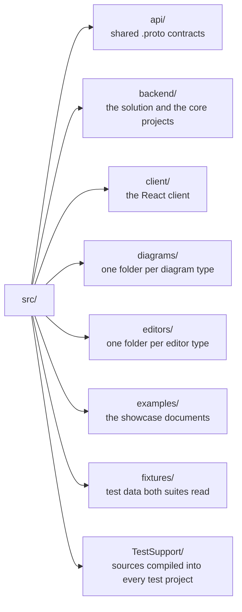

# The solution structure

**Where the code is, how much of it there is, and which project owns what.** Its companion is [architecture.md](architecture.md), which answers *what the system is* rather than *where it lives*.

## The shape of `src/`

`src/TestSupport` is **not** a project. It holds three source files that `src/Directory.Build.targets` compiles *into* each `*.Tests` project, deliberately rather than as a referenced assembly — the reasoning is in that file and is load-bearing. Do not confuse it with `EtAlii.Adp.TestSupport`, which **is** a project, under `src/backend`.

## The solution, with its counts

`src/backend/EtAlii.Adp.slnx` holds **111** projects, as a flat list rather than a folder hierarchy, so the whole thing opens and builds as one solution in Rider:

| Split | Count |
| --- | --- |
| core | **29** |
| diagram | **78** |
| editor | **4** |
| production | **79** |
| test | **32** |

Those are **two different splits of the same 111**, and a figure appearing in both tables is a coincidence rather than a correspondence, which is exactly what makes a wrong classification look right.

There are **127** tracked `.csproj` files under `src/`, which is **16** more than the solution holds. Every one of the 16 is fixture or example data belonging to `src/diagrams/dotnet-dependency-graph` — a module whose subject matter *is* reading `.csproj` files, so its test fixtures and its showcase project are themselves `.csproj`. **A page claiming "127 projects" would be wrong in the confident direction.**

## The relative-path trap

**The solution's project paths are relative to `src/backend/`.** A core project therefore appears as `EtAlii.Adp.Context/EtAlii.Adp.Context.csproj` with no `backend` segment, while a diagram project appears as `../diagrams/<type>/backend/...`.

Classifying by path segment — "count the ones containing `backend`" — yields a plausible **82 / 29** split that is not the core/module split at all. When this page was first written that split was 78 / 27 and matched the production/test sizes exactly, which is how it survived a sanity check; the coincidence has since ended, and the trap has not. **Classify core projects by the absence of a leading `../`.**

## The core projects

**14** production:

| Concern | Project |
| --- | --- |
| Shared primitives | `EtAlii.Adp` |
| Host and composition | `EtAlii.Adp.Backend`, `EtAlii.Adp.Backend.Service` |
| Sign-in | `EtAlii.Adp.Authentication` |
| Open documents, the shared wire vocabulary, and the diagram definition contract | `EtAlii.Adp.Documents` |
| Selection, actions, properties, prompts | `EtAlii.Adp.Context` |
| Commands and undo/redo | `EtAlii.Adp.History` |
| Errors and warnings | `EtAlii.Adp.Problems` |
| Known projects and workspace roots | `EtAlii.Adp.Projects` |
| Connection lifetime | `EtAlii.Adp.Sessions` |
| Workspace tree and file watching | `EtAlii.Adp.Hierarchy` |
| Diagram-type abstractions, including the validation contract | `EtAlii.Adp.Diagram` |
| Editor-family abstractions | `EtAlii.Adp.Editor` |
| Test helpers shipped as a project | `EtAlii.Adp.TestSupport` |

**15** test: `EtAlii.Adp.Tests`, `EtAlii.Adp.Authentication.Tests`, `EtAlii.Adp.Backend.Tests`, `EtAlii.Adp.Client.Tests`, `EtAlii.Adp.Context.Tests`, `EtAlii.Adp.Diagram.Tests`, `EtAlii.Adp.Documents.Tests`, `EtAlii.Adp.Editor.Tests`, `EtAlii.Adp.Hierarchy.Tests`, `EtAlii.Adp.History.Tests`, `EtAlii.Adp.HostLogging.Tests`, `EtAlii.Adp.Problems.Tests`, `EtAlii.Adp.Projects.Tests`, `EtAlii.Adp.Repository.Tests`, `EtAlii.Adp.Sessions.Tests`.

Not every production project has a matching test project, and that is not a gap to close by reflex — some are covered from `EtAlii.Adp.Backend.Tests`.

**This list was measured from the solution, not written from memory**, and `ArchitecturePages.Tests` holds it there: every name above must be a project in `EtAlii.Adp.slnx`. That guard is the whole reason to trust it. The list this replaced was written from memory, named two projects that have never existed, and omitted fifteen that do — and it read as authoritative for as long as nothing checked it.

## A module's folder shape

A diagram type is `src/diagrams/<type>/` with up to four parts:

- `backend/` — its projects, `EtAlii.Adp.Diagram.<Type>` and `.Tests`
- `api/` — its own `.proto`, when it has wire messages of its own
- `client/` — its canvas and registration
- `examples/` — documents a reader can open

Editors are the same shape under `src/editors/<type>/`, with `EtAlii.Adp.Editor.<Type>`. [creating-a-diagram-module.md](creating-a-diagram-module.md) walks one module end to end.

## Namespaces, and the folders that do not contribute

Namespaces are `EtAlii.Adp.<Area>`, following the project rather than the folder tree — `EtAlii.Adp.Backend`, `EtAlii.Adp.Context`, `EtAlii.Adp.Diagram`. A test project appends `.Tests`. Outside .NET the same intent is spelled the language's own way, as `com.etalii.adp.<area>`. .NET types and their files are `PascalCase`; the client follows its own tooling's convention, kept consistent within the client.

**`EtAlii.Adp.Diagram` is singular, and carries no `Backend` segment.** A plural form and a `Backend`-prefixed form have both been written down as though they existed — three times between them, one of which was the naming rule's own worked example, so the rule told a reader checking against it the wrong answer. **This page cannot spell either form**, even to deny it: the guard rejects any `EtAlii.Adp.*` name on it that is not a project in the solution, which is what found the third instance and then immediately caught this sentence's first draft.

Four folder names are deliberately **skipped** when a namespace is derived — `_Model`, `Commands`, `History` and `Support` — so a type in `Context/Commands/` stays in `EtAlii.Adp.Context`.

The skips are declared per project in a `.csproj.DotSettings` file, and `NamespaceProviders.Tests` asserts every declared namespace matches project-plus-unskipped-folders. **A namespace that looks wrong for its folder is usually right**; check the `.DotSettings` before "correcting" it.

**Identities are `ShortGuid`** (`src/backend/EtAlii.Adp/ShortGuid.cs`): a `Guid` in a fixed-length 25-character base36 form, used wherever an id is needed. The base36 spelling is a display and URL concern — on the wire it travels as a `Guid`. The steering documents called this type `ShortId` until this page replaced them, and no such type has ever existed.

## Where tests and fixtures live

A test project sits beside its subject as `<Project>.Tests`, or is named for its purpose as `EtAlii.Adp.<Purpose>.Tests` where it has no single subject project: `EtAlii.Adp.Client.Tests` runs the client suite, `EtAlii.Adp.Repository.Tests` holds the guards whose subject is the repository itself - its documents, scripts and conventions - and `EtAlii.Adp.HostLogging.Tests` exists to hold **one class on purpose**. That class asserts which host's pipeline the process-wide `Log.Logger` points at, and a test assembly is its own process, so no other class's host can move it; a second host-booting class there ends that. Inside one, `Fixtures/**` is **test input, not product** — and for the modules whose round-trip requirement compares bytes, those fixtures are marked `-text` in `.gitattributes` so git does not rewrite their line endings and turn the test into a test of git.

`src/fixtures/cross-tier/` is a different thing with a similar name: **one JSON file per rule the backend and the client must agree on**, each carrying its cases and the rule's own statement in a `reason` field, and read by both suites. It sits outside both because a client test reaching into the backend's folders would invert the dependency the whole tree is arranged to avoid.

Showcase documents live in `src/examples/`, not in a module's `Fixtures/`. The two look alike and are not: one is read by tests, the other is opened by a person.

`src/examples/` is itself one ADP project — the folder a reader opens to meet every type in a single explorer tree — and a module joins it by having its examples copied in, under `src/examples/diagrams/<type>/<set>/` or `src/examples/editors/<type>/<set>/`. **The showcase nests by how a diagram reads rather than by module, and it does so inconsistently**, so a path built by rule from a module's name will miss; list the folder instead. A tree comparison that maps one side onto the other by path will report files as missing that are simply somewhere else.

**The two copies are deliberately no longer identical**, since 2026-09-04. They were, byte-for-byte, with a test enforcing it — but the showcase is a working surface, and arranging a diagram in the running app writes a `layout:` block into the showcase copy while the module copy stays put. The guard read five instances of ordinary use as drift and was removed. What still holds of both trees is that every example registration opens against the deployed catalog, which `ExampleRegistration.Tests` walks in both places. **A module may still hold its own copies identical**, and three do: dependency-graph and both editors each require a byte-identical replica from their own `Examples.Tests`, so "the trees are unsynced" is true tree-wide and false for those three.

## What this page is not

**Descriptive, not normative.** It says where things are; the rules live in [`CLAUDE.md`](../CLAUDE.md) and the steering documents, and when this page disagrees with a rule, the rule wins and this page is stale.

**Refresh rule:** [`CLAUDE.md`, *The architecture pages*](../CLAUDE.md#the-architecture-pages) - update the page in the same change that makes one of its sentences false, as [*Documentation refresh*](../CLAUDE.md#documentation-refresh) asks of every delivered document.

**Not covered here, deliberately** (a later pass, each its own specification): what is inside a module, the wire contracts and generated code, the client component tree, deployment and hosting, and the editor family's internals.

**Its guard is `ArchitecturePages.Tests`** (`src/backend/EtAlii.Adp.Repository.Tests/ArchitecturePages.Tests.cs`), listed in [guards.md](guards.md). It checks that every path and project name here exists, that every count above recomputes from the tree, and that the page stays within its size limit.

**It cannot check whether a description is still accurate.** Every count on this page is guarded; every *sentence* around them is not. A concern column that names the wrong project would pass silently, because the project exists.
