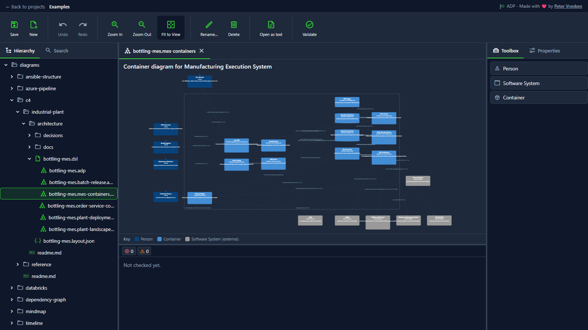
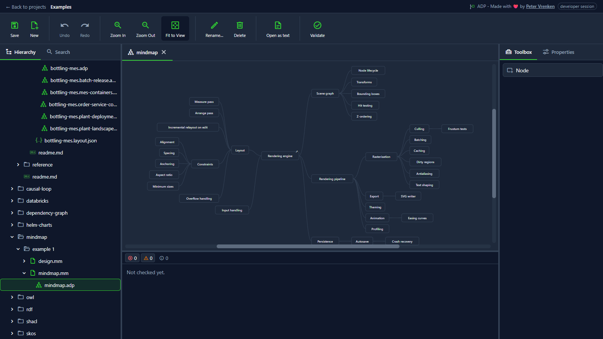
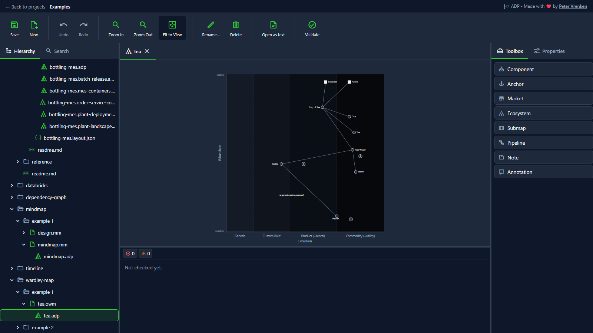
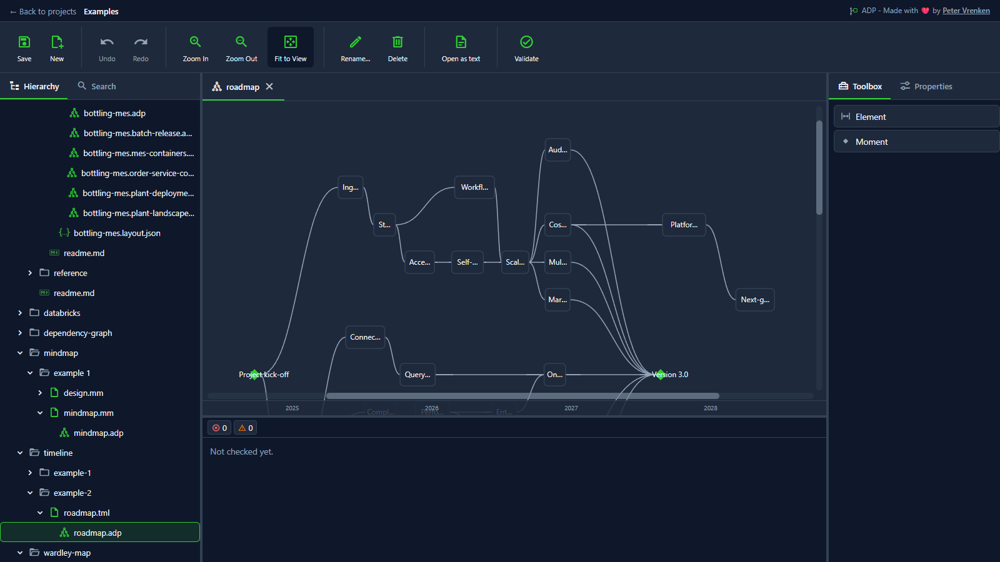
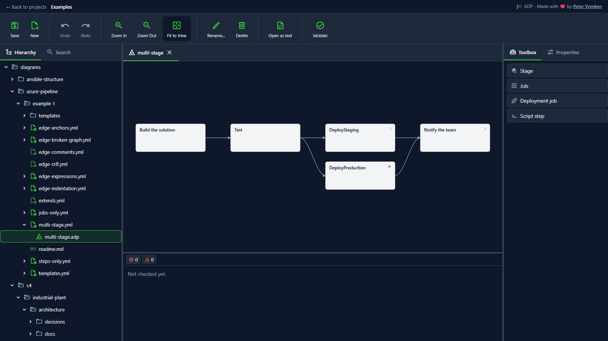
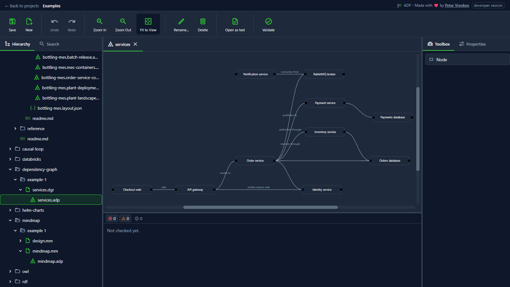
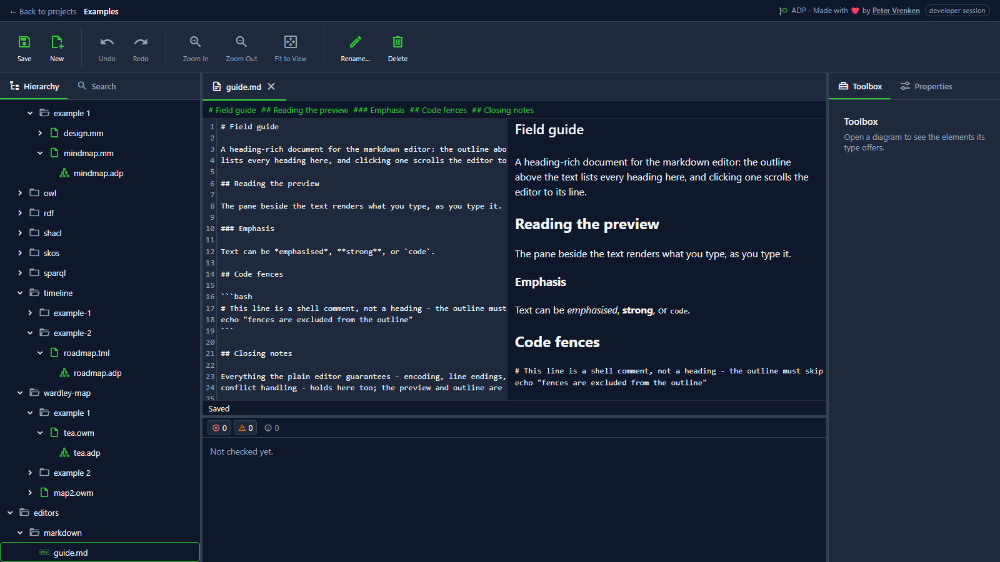

# ADP — A Different Perspective

Specialized diagram, designer and editor experiences, each tuned to one task, backed by plain files that live beside the work they describe. This repository is the standalone web workspace host.

## Why

Some things are understood better as a picture than as prose, and better as a picture made for that one task than as a general-purpose one. General-purpose drawing tools can draw anything, but they know nothing about what is being drawn, and so they help with none of it. ADP — "A Different Perspective" — is a family of specialized designers for every situation in which a specialized visualization serves better than a generalized one or a textual description. Architecture is where ADP began, and its notations are well represented here; the designers now being introduced target (constructive) technology assessment, collaboration between humans and agents, and bringing clarity to textual data.

What a designer shows lives **in the repository**, as plain, diffable files, under the same version control as the work it describes. A diagram here is not a picture exported from a modelling database; it is a text document you can review in a pull request, branch, merge, and blame — and open in ADP to view and edit it live. Where a well-known notation or file format already exists, ADP embraces it rather than inventing its own: a mindmap is a Freeplane file, a C4 model is a Structurizr DSL workspace, a Wardley map is an OnlineWardleyMaps document — each still openable by the tool that owns the format, byte-for-byte, after ADP has edited it.

Because the files sit beside the work, diagram elements can do more than illustrate: they can link to what they represent, so the picture stays legible — to humans reading the repository, and to the agents working beside them — as its subject evolves. Changes to the underlying files — from ADP itself, another editor, or a `git pull` — are pushed live into open views.

**ADP is not one application.** Each diagram, designer and editor is described by a markup-language definition, specified in [`etalii.adp`](https://github.com/etalii-adp/etalii.adp), and interpreted by a core plugin in each supported IDE: this standalone web workspace, IntelliJ Platform IDEs, VS Code and Eclipse, each in its own repository. Where a definition alone is not enough, that host's plugin adds the code to support it. This repository's technical shape describes this host only, not the standard the others follow.

And it starts small on purpose: one repository, local files, no server infrastructure to roll out. ADP should already be worth having in a single repository, before any wider adoption decision is made. The full product thinking lives in [`product.md`](.spec-workflow/steering/product.md).

## What it looks like

The workspace, with a C4 diagram open from the bundled examples:

A few of the diagram types, each backed by a plain text file:

| | |
|---|---|
|  |  |
|  |  |

And a dependency graph, plus the markdown editor with its live preview and heading outline:

| | |
|---|---|
|  |  |

Every screenshot is taken from the [`src/examples/`](src/examples/) project — how, exactly, is recorded in [`docs/screenshots/readme.md`](docs/screenshots/readme.md), so any of them can be retaken after the UI changes.

## Getting started

### From a release

Each green build of `develop` publishes a versioned ZIP on the [Releases page](https://github.com/etalii-adp/etalii.adp.ide.standalone/releases). It is platform-neutral and needs the .NET 10 runtime:

1. Unpack the ZIP.
2. Set a username and credential under `LocalAuthenticator` in `appsettings.json` — the shipped values are deliberately empty.
3. Run `dotnet EtAlii.Adp.Backend.Service.dll` and browse to the address it logs.

### From source

You need the .NET SDK pinned by [`src/global.json`](src/global.json) and Node 22.

1. `npm install` in `src/` — the client and the diagram modules form one npm workspace.
2. Start the backend from `src/backend/EtAlii.Adp.Backend.Service/` with `dotnet run` in the `developer` environment (Rider/VS: the default launch profile does this; it listens on port 5080, which is the address your browser uses).
3. Start the client dev server from `src/client/` with `npm run dev` (port 5174 — the backend proxies to it, so edits hot-reload without a rebuild).
4. Browse to `http://localhost:5080` and log in with the developer credentials from [`appsettings.developer.json`](src/backend/EtAlii.Adp.Backend.Service/appsettings.developer.json): `admin` / `changeme`.

To run the repository's own gates — backend tests, style, client tests, typecheck — use the exact commands [CLAUDE.md](CLAUDE.md) defines; the CI pipeline runs the same four.

### Your first session

1. Log in.
2. Add a project: point ADP at a folder. Start with this repository's own [`src/examples/`](src/examples/) — it is a ready-made ADP project showing every implemented diagram type and editor in one explorer tree.
3. Open diagrams from the explorer, drag things around, and watch the underlying text files change — then `git diff` them.

## Going deeper

- **[The architecture](docs/architecture.md)** — what ADP is and how its parts talk: one process serving the client and the gRPC endpoint, the two call legs that stand in for bidirectional streaming, where a diagram lives, and what the canvas actually is.
- **[The solution structure](docs/solution-structure.md)** — where the code is: the folders under `src/`, how the solution's projects split, which project owns which concern, and the counting traps that make a plausible wrong answer about all of it.
- **[The diagram type catalog](docs/diagrams.md)** — every diagram type ADP could support, from merely identified through specified to implemented, with the state of each tracked as the repository moves.
- **[Creating a diagram module](docs/creating-a-diagram-module.md)** — the developer walkthrough for adding a new diagram type, traced against a real shipped module.
- **[Creating an editor module](docs/creating-an-editor-module.md)** — the same for the text-editor plugin family.
- **[Dependencies](docs/dependencies.md)** — what ADP is built on: every direct dependency with its version, the reason it is there, and its license.
- **[The guards](docs/guards.md)** — the tests and checks that hold properties of the whole tree rather than the behaviour of one subject, each with the question it answers, so you can tell before you start whether one already covers what you are about to change.
